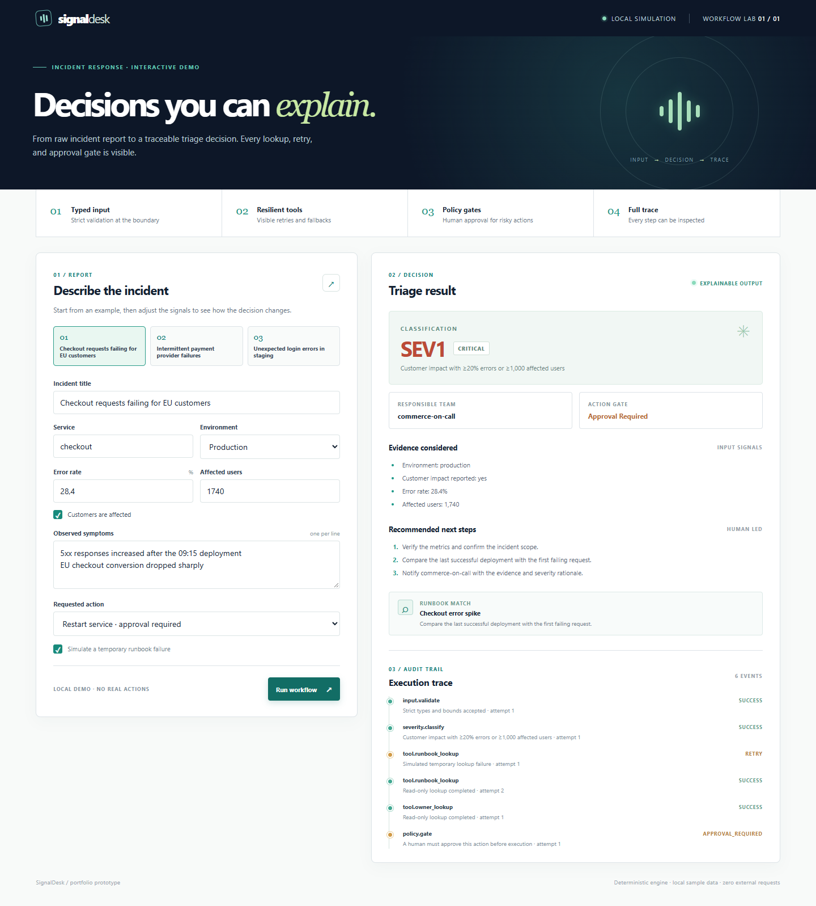

# SignalDesk — explainable incident workflow

An interactive incident triage demo built around a simple question: **can an automated decision be checked by a human?** Submit an incident report and SignalDesk validates its inputs, calculates severity, consults local tools, retries a transient failure, applies an action policy, and returns the full execution trace.

The project runs locally with **Python 3.10+ and no third-party dependencies**. It uses sample data and makes no network requests to external services. All operational actions are proposals; nothing is executed against a real system.



## See it in action

```bash
python run.py
```

Open **http://127.0.0.1:8000**. Choose one of the three incidents, change a metric or requested action, and run the workflow again. The checkout example deliberately simulates a temporary runbook failure so the retry is visible in the audit trail.

On Windows, if `python` is unavailable, try `py -3 run.py`.

For a quick terminal demo:

```bash
python run.py --demo
```

## What it demonstrates

| Stage | Implementation | Visible result |
| --- | --- | --- |
| Input boundary | Strict typed incident model, bounds, and rejected unknown fields | Invalid reports receive HTTP 400 with a clear error |
| Classification | Explicit severity policy | Severity plus the exact rule that applied |
| Tool calls | Read-only runbook and owner lookups | Matched runbook and responsible team |
| Resilience | Bounded retry of a recoverable lookup failure | Each attempt appears in the trace |
| Action safety | Allowlisted actions with human approval gates | `ready`, `approval_required`, or `blocked` |
| Audit | Structured event log | Every step, status, detail, and attempt number |

The engine is deterministic by design. It is a **workflow/agent simulation**, not a claim of a live LLM integration. Incident text is treated as data; only validated structured fields influence the decision. This makes the safety behavior testable and the demo reproducible without an API key.

## Architecture

```text
Browser UI ──POST /api/run──> HTTP adapter
                              │
                              ▼
                        Strict input model
                              │
                              ▼
                        Severity policy
                              │
                              ▼
                     Runbook + owner tools
                       (bounded retries)
                              │
                              ▼
                        Action policy
                              │
                              ▼
                    Decision + audit trace
```

The server serves only three local UI files and the two read-only API endpoints (`/api/health`, `/api/examples`) plus `POST /api/run`. It binds to `127.0.0.1` by default.

### Example API request

```bash
curl -X POST http://127.0.0.1:8000/api/run \
  -H "Content-Type: application/json" \
  --data-binary @examples/checkout-outage.json
```

On PowerShell, use `curl.exe` for the command above or run `python run.py --demo`.

### Decision policy

- **SEV1:** production, customer impact, and at least 20% errors or 1,000 affected users.
- **SEV2:** production, customer impact, and at least 5% errors or 100 affected users.
- **SEV3:** other measured production impact.
- **SEV4:** non-production or no measured production impact.

`restart_service` and `publish_status` require human approval. Unknown actions are blocked. The engine never executes actions: `real_world_actions_executed` is always `0`.

## Tests

```bash
python -m unittest discover -s tests -v
```

Tests cover severity boundaries, invalid input, retry recovery, unknown services, action gates, untrusted text, JSON serialization, and a real local HTTP request.

## Project structure

```text
workflow-lab/
├── examples/          Three editable incident reports
├── static/            Responsive, dependency-free browser UI
├── tests/             Unit and HTTP integration tests
├── workflow_lab/
│   ├── models.py      Strict input model
│   ├── engine.py      Workflow and policy decisions
│   ├── tools.py       Local read-only tool fixtures
│   └── server.py      Local HTTP adapter
├── run.py             Entry point and terminal demo
└── README.md
```

## Extension ideas

The explicit boundaries make it possible to replace the local lookups with real service adapters, move the HTTP layer to FastAPI, or add an LLM-generated recommendation. For a live system, I would keep the typed validation and human action gate, add authentication, persistence, rate limiting, and exponential backoff, and test the external adapters separately. Those production integrations are intentionally outside this demo.

## License

MIT. See [LICENSE](LICENSE).
